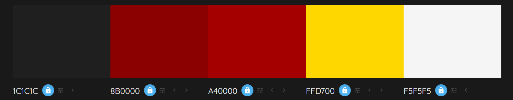

- [UX](#ux)
  - [New User Stories](#new-user-stories)
  - [Existing Users](#existing-users)
  - [Typography](#typography)
  - [Color Scheme](#color-scheme)
- [Wireframes](#wireframes)
  - [Mobile](#mobile)
  - [Tablet](#tablet)
  - [Desktop](#desktop)
- [Features](#features)
  - [Existing Features](#existing-features)
  - [Future Features](#future-features)
- [Deployment](#deployment)
  - [GitHub Pages](#github-pages)
  - [Forking the GitHub Repository](#forking-the-github-repository)
  - [Making a Local Clone](#making-a-local-clone)
- [Tools and Technologies Used](#tools-and-technologies-used)
  - [Content](#content)
  - [Media](#media)
  - [Credits](#credits)


I created this game as a fun way to see how quickly you can guess words from scrambled letters.  On the main screen, you'll find a Start Game button to start playing and a How to Play button to read the instructions first.

 Each round allows you 60 seconds to guess the word.  If you find yourself stuck, you can use up to three hints. Simply input your answer and hit submit if you're correct, you'll earn points and move on to the next word.

 It's an easy and entertaining game to keep your mind working!
 
A live version of the project can be accessed here: [Word Quest](kulthoom12.github.io/Word-Quest/)

## UX

### New User Stories

- As a new user I would like to see a clear title so I know what the game is.
- As a new user I would like to see a Start Game button so I can begin playing easily.
- As a new user I would like to see an Instructions button to understand how to play.
- As a new user I would like to see scrambled letters and a place to type my guess.
- As a new user I would like to see a timer and score so I can track my progress.
- As a new user I would like to see a hint button to help me if I get stuck.
- As a new user I would like to see a restart button in case I want to play again.

### Existing Users

- As an existing user I would like hints that help without giving too much away.
- As an existing user I would like the game to feel smooth and easy every time.
- As an existing user I would like to enjoy the challenge and improve my guessing skills.

### Typography 

**[Comic Neue](https://fonts.google.com/specimen/Chewy)**: was selected for its clean, rounded letters and friendly design. It’s easy to read, even on smaller screens, and brings a casual feel that doesn’t distract from gameplay. As a secondary font, it supports clarity and usability while keeping the visual style fun and accessible.

**[Chewy](https://fonts.google.com/specimen/Comic+Neue)**: was chosen as the main display font because of its bold, playful, and cartoon-like appearance. It adds a fun and energetic vibe to the game, making the interface feel more engaging and appealing. This font helps set a light-hearted tone right from the start, which matches the purpose of the game—to entertain and challenge in a relaxed way.

### Color Scheme

| Colour     | Hex     | Reason                                                                      |
| ---------- | ------- | --------------------------------------------------------------------------- |
| Deep Teal  | #0f2027 | This dark background feels calm and helps other colours stand out.          |
| Lime Green | #32cd32 | Bright green that catches your eye and makes the game feel lively.          |
| Dark Green | #28a428 | Slightly darker green used for hover effects to show buttons are clickable. |
| Gold       | #FFD700 | Shiny gold used to highlight important things like scores or hints.         |



## Wireframes

### Mobile 
### Tablet
### Desktop 

## Features

### Existing Features

The **Word Quest** game is designed to be fun, easy to use, and enjoyable on any device.

The look of the game stays the same throughout, with a dark teal background that makes the bright green buttons and gold highlights stand out. This helps players know where to click and what to focus on.

Everything you need to play is clearly laid out — the scrambled word, timer, score, and buttons for submitting, getting a hint, or restarting the game.

The game also works well on phones, tablets, and computers, so you can play wherever you like without anything looking messy or out of place.

### Future Features

- **Difficulty Levels**  
  Players will be able to choose between easy, medium, and hard modes to match their skill level.

- **High Score Tracking**  
  The game will keep track of top scores so players can aim to beat their personal best.

## Deployment

### GitHub Pages

To deploy the website, follow these steps:

1. Log in to [GitHub](https://github.com/).
2. Go to the repository: **[kulthoom12/word-quest](https://github.com/kulthoom12/word-quest)**.
3. Click on the **Settings** tab.
4. Click the **Code and automation** section and then click **Pages**.
5. Under **Build and deployment**, select the **main** branch.
6. Click **Save**.

The **word-quest** website is hosted on GitHub Pages. You can view the live website by clicking [here](https://github.com/kulthoom12/word-quest).

### Forking the GitHub Repository

To create a copy of the repository in your own GitHub account:

1. Log in to [GitHub](https://github.com/).
2. Search for **[kulthoom12/word-quest](https://github.com/kulthoom12/word-quest)** repository.
3. Click on the **Fork** button at the top-right corner and click select **Create a new fork**.
4. Now, the repository will be copied to your GitHub account, and you can make changes without affecting the original one.

### Making a Local Clone

To download the project to your computer:

1. Log in to [GitHub](https://github.com/).
2. Go to **[word-quest](https://github.com/kulthoom12/word-quest)**.
3. Click on the **Code** button and select **Clone**.
4. Copy the repository URL.
5. Open your terminal or Git Bash in your preferred code editor.
6. Type this command and hit Enter:
   ```bash
   git clone https://github.com/kulthoom12/word-quest

## Tools and Technologies Used

| Source | Link |
|---------|------|
| Word Guessing Game Tutorial | [YouTube - Word Guessing Game](https://www.youtube.com/watch?v=JYVycJ2CXiI) |
| JavaScript Crash Course | [YouTube - Mosh](https://www.youtube.com/watch?v=W6NZfCO5SIk) |
|JavaScript Full Course | [YouTube - Bro Code](https://www.youtube.com/watch?v=Ihy0QziLDf0&list=PLZPZq0r_RZOO1zkgO4bIdfuLpizCeHYKv) |
| JavaScript Game Tutorial | [YouTube - Ali Aslan](https://www.youtube.com/watch?v=2wJKJRa9ncI) |
| Online Learning Platform | [Code Institute](https://learn.codeinstitute.net/dashboard) |
| Fonts | [Google Fonts](https://fonts.google.com/) |
| Color Palette Generator | [Colormind](http://colormind.io/) |
| Developer Tools | [Chrome DevTools](https://developer.chrome.com/docs/) |


### Content

### Media

### Credits

I would like to thank my tutor Robert Thompson and my mentor Lauren-Nicole for their support with completing this project.


