### Table of Content

- [UX](#ux)
- [User Stories](#new-user-stories)
- [Wireframes](#wireframes)
- [Features](#features)
- [Technologies Used](#technologies-used)
- [Credits](#credits)
- [Testing](#testing)
- [Deployment](#deployment)
- [Acknowledgements](#Acknowledgements)

# Word Quest

**Word Quest** is a fun and thrilling game designed to test your detective skills by solving mystery-themed scrambled words.

On the main screen, you can press **Start Game** to dive into the challenge, or **How to Play** to view the instructions first.

Each round gives you 60 seconds to decode a scrambled word. If you get stuck, you can use up to three hints. Type in your answer and hit **Submit** — if you're correct, you'll earn points and move on to the next clue.

It’s a fast-paced, brain-teasing game perfect for crime lovers and puzzle enthusiasts alike!

 You can click the link to view my live website: [Play Word Quest](https://kulthoom12.github.io/Word-Quest/)

## UX

### Target Audience 

This word guess game is for anyone who enjoys a fun and easy word puzzle. It’s great for teens and adults looking to challenge their vocabulary or just have a quick, entertaining way to pass the time. You can play it on your phone, tablet, or computer, so it’s perfect for students, casual gamers, or anyone learning a new language.

### How to play

Getting started is easy! Just hit the **Start Game** button, and you’ll see a scrambled word appear. Your job is to figure out what the word is and type it in, then press **Submit** to check your answer. If you’re stuck, don’t worry—you can click the Hint button to reveal a letter, but use it wisely because you only get three hints per word. If you want to try again or start fresh, just hit the **Restart** button. Have fun guessing and see how many words you can solve before time runs out!

### Game Flow 

When you start the game, you’ll see a scrambled word on the screen. Your goal is to figure out what the word is by guessing the correct letters. If you get stuck, don’t worry — you can use **hints** to help you out. Once you think you’ve got the word, just hit **Submit**. If your answer is correct, the game moves on to the next word and the fun continues!

If you make a mistake, you can try again or hit **Restart** at any time. The game’s simple and relaxed flow makes it fun to play without any pressure.

### Color Scheme

<details> <summary> Click here to view the color scheme table </summary>

| Colour Name     | Hex     | Reason                                                |
| --------------- | ------- | ----------------------------------------------------- |
| Very Dark Grey  | #1c1c1c | Dark, moody background to set a mysterious tone.      |
| Dark Red        | #8B0000 | Deep red for a dramatic and intense feel.             |
| Bright Red      | #A40000 | Brighter red to highlight urgent actions.             |
| Gold            | #FFD700 | Gold for important highlights and clues.              |
| Very Light Grey | #F5F5F5 | Light text color for easy reading on dark background. |

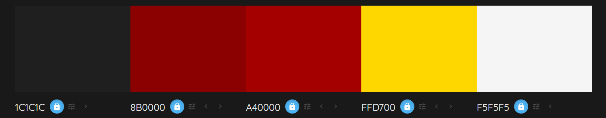
</details>

### Typography 

For **Word Quest**, I chose two fonts that really help bring the mystery and crime theme to life.

**Primary Font – Roboto Slab**

Roboto Slab is used throughout the main parts of the game—like instructions, buttons, and gameplay text. It’s clean, easy to read, and has a slightly serious tone, which fits well with the idea of solving crimes. It reminds you a bit of old police files or typewritten reports, helping to set the scene.

**Secondary Font – Cinzel Decorative**

This one’s used for headings and titles. Cinzel Decorative has a dramatic and slightly vintage feel, which adds to the mystery. It makes you think of something secretive or hidden, like an unsolved case or a mysterious letter.

Together, these fonts help create the right mood—one that feels like you're stepping into a detective story, but still keeps everything clear and readable while playing.

## User Stories 

### New User Stories

- As a new user, I would like to see a clear word so I know what the game is.
- As a new user, I would like to see a **Start Game** button so I can begin playing easily.
- As a new user, I would like to see an **Instructions** button to understand how to play.
- As a new user, I would like to see scrambled letters and a place to type my guess.
- As a new user, I would like to see a timer.
- As a new user, I would like to see a **Hint** button to help me if I get stuck.
- As a new user, I would like to see a **Restart** button in case I want to play again.

### Existing Users

- As an existing user, I would like hints that help without giving too much away.
- As an existing user, I would like the game to feel smooth and easy every time.
- As an existing user, I would like to enjoy the challenge and improve my guessing skills.

## Wireframes

### Mobile 

<details> <summary> Click to view the Mobile Wireframes</summary>
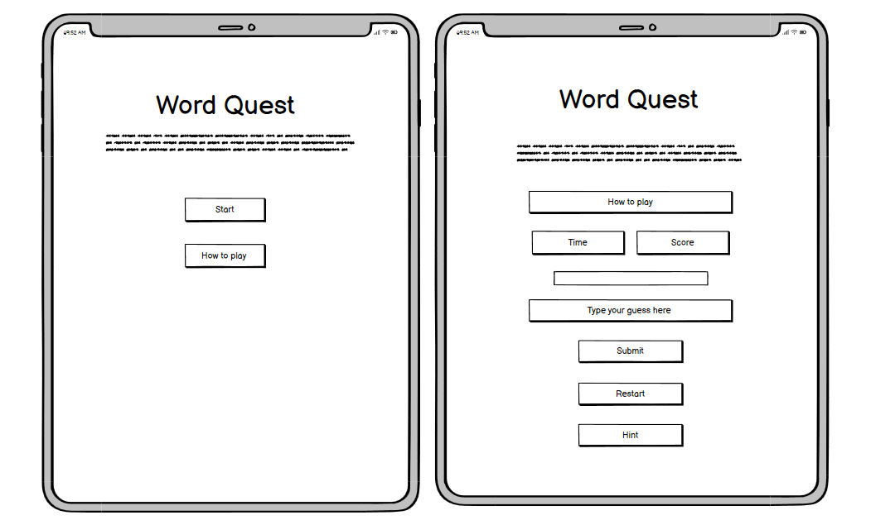

</details>

### Tablet

<details> <summary> Click to view the Tablet Wireframes</summary>


</details>

### Desktop 

<details> <summary> Click to view the Laptop Wireframes</summary>
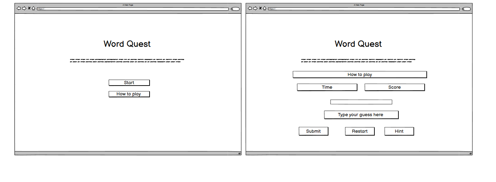

</details>

## Features

### Existing Features

<details> <summary> Click here to view the table </summary>

| Feature                          | Description                                                    | Screenshot                                      |
| --------------------------------| -------------------------------------------------------------- | -----------------------------------------------|
| Home Page                       | Welcomes players with the game title and a mysterious tagline.| 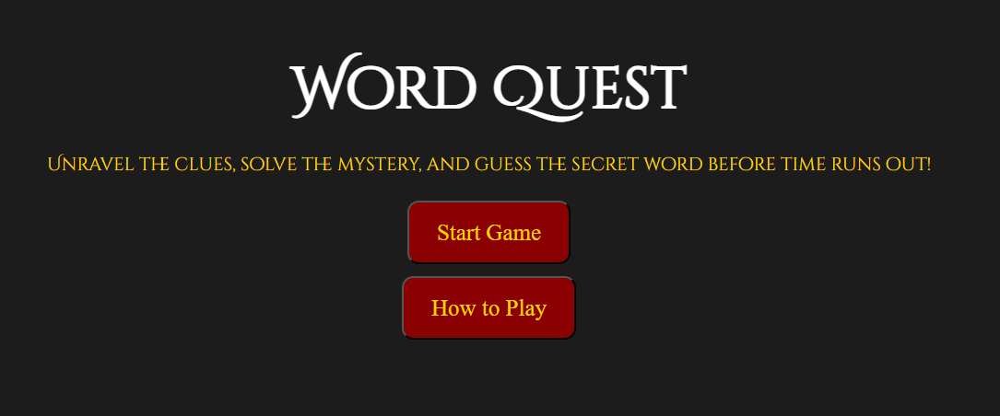        |
| Instructions                   | Easy-to-follow steps explaining how to play, accessible anytime.| 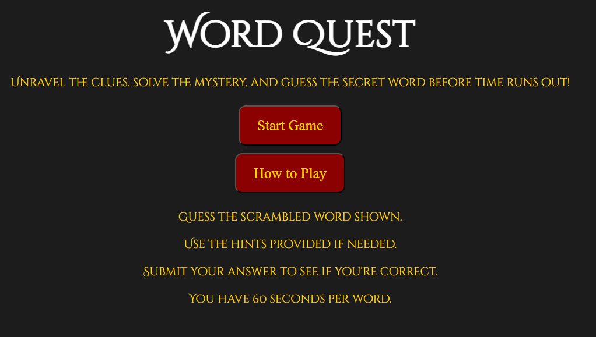|
| Scrambled Letters and Underscores| Displays scrambled words and underscores to guide guesses.   | 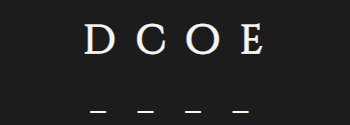  |
| Answer Box                     | Input field where players type their answers.                  |         |
| Hints Used                    | Tracks how many hints have been used during the game.          | 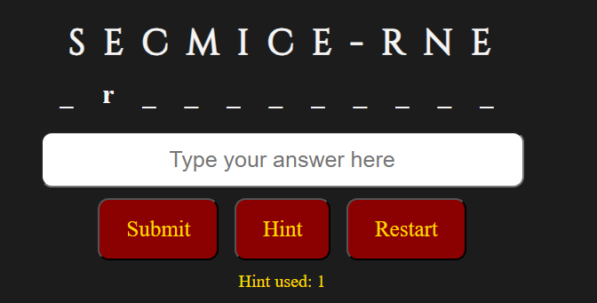    |
| No More Hints Message          | Alerts when all hints have been used up.                       | 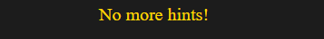|
| Submit, Hint & Restart Buttons | Allows players to submit guesses to check correctness.         | 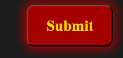      |
| Time’s Up! Message             | Notifies when time runs out and the round ends.                | 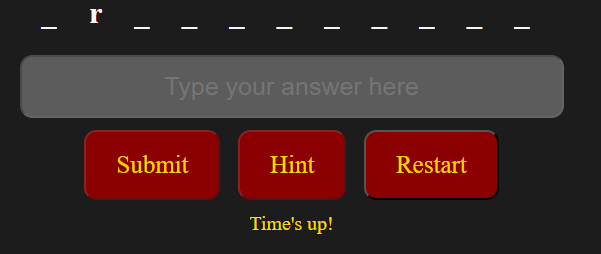         |
| Score Display                 | Shows current progress or points during gameplay.              | 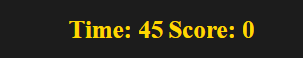       |

</details>

### Future Features
- **Difficulty Levels**  
  Players can choose between Easy, Medium, and Hard modes to match their skill level.

- **High Score Tracking**  
  The game will track top scores, allowing players to aim to beat their personal best.

## Technologies Used

<details> <summary>Click here to view the table</summary>

| Source                  | Link                                                      |
|-------------------------|-----------------------------------------------------------|
| Fonts                   | [Google Fonts](https://fonts.google.com/)                 |
| Color Palette Generator | [Colormind](http://colormind.io/)                         |
| Developer Tools         | [Chrome DevTools](https://developer.chrome.com/docs/)     |
| GitHub                  | [GitHub](https://github.com/)                             |
| Chrome DevTools         | [Google Chrome DevTools](https://developer.chrome.com/)   |
| Favicon Generator       | [favicons.io](https://favicons.io/)                       |

</details>

### Credits

I would like to thank my tutor Robert Thompson and my mentor Lauren-Nicole for their support with completing this project.

<details> <summary>Click here to view the table</summary>

| Source                      | Link                                                                                                      |
| --------------------------- | --------------------------------------------------------------------------------------------------------- |
| Word Guessing Game Tutorial | [YouTube - Word Guessing Game](https://www.youtube.com/watch?v=JYVycJ2CXiI)                               |
| JavaScript Crash Course     | [YouTube - Mosh](https://www.youtube.com/watch?v=W6NZfCO5SIk)                                             |
| JavaScript Full Course      | [YouTube - Bro Code](https://www.youtube.com/watch?v=Ihy0QziLDf0&list=PLZPZq0r_RZOO1zkgO4bIdfuLpizCeHYKv) |
| JavaScript Game Tutorial    | [YouTube - Ali Aslan](https://www.youtube.com/watch?v=2wJKJRa9ncI)                                        |
| Online Learning Platform    | [Code Institute](https://learn.codeinstitute.net/dashboard)                                               |

</details>

## Testing 

Click here to open the [TESTING.md](TESTING.md) file.

## Deployment

### GitHub Pages

To deploy the website, follow these steps:

1. Log in to [GitHub](https://github.com/).
2. Go to the repository: **[kulthoom12/word-quest](https://github.com/kulthoom12/word-quest)**.
3. Click on the **Settings** tab.
4. In the **Code and automation** section, click **Pages**.
5. Under **Build and deployment**, select the **main** branch.
6. Click **Save**.

The **Word Quest** website is hosted on GitHub Pages. You can view the live website [here](https://kulthoom12.github.io/word-quest).

### Forking the GitHub Repository

To create a copy of the repository in your own GitHub account:

1. Log in to [GitHub](https://github.com/).
2. Go to the **[kulthoom12/word-quest](https://github.com/kulthoom12/word-quest)** repository.
3. Click the **Fork** button at the top-right corner and select **Create a new fork**.
4. The repository will be copied to your GitHub account, and you can make changes without affecting the original.

### Making a Local Clone

To download the project to your computer:

1. Log in to [GitHub](https://github.com/).
2. Go to the **[kulthoom12/word-quest](https://github.com/kulthoom12/word-quest)** repository.
3. Click on the **Code** button and select **Clone**.
4. Copy the repository URL.
5. Open your terminal or Git Bash in your preferred code editor.
6. Type the following command and press Enter:
   ```bash
   git clone https://github.com/kulthoom12/word-quest