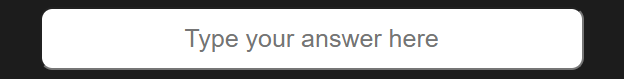

### Table of Content

- [UX](#ux)
- [User Stories](#new-user-stories)
- [Wireframes](#wireframes)
- [Features](#features)
- [Technologies Used](#technologies-used)
- [Credits](#credits)
- [Meida](#meida)
- [Testing](#testing)
- [Deployment](#deployment)
- [Acknowledgements](#Acknowledgements)

# Word Quest

I created this game as a fun and thrilling way to test your detective skills by solving mystery-themed scrambled words.

On the main screen, you can press **Start Game** to dive into the challenge, or **How to Play** to read the instructions first.

Each round gives you 60 seconds to decode a word. If you get stuck, you can use up to three hints. Type in your answer and hit **Submit** — if you're right, you’ll earn points and move on to the next clue.

It’s a fast-paced, brain-teasing game perfect for crime lovers and puzzle solvers alike!

A live version of the project can be accessed here: [Word Quest](kulthoom12.github.io/Word-Quest/)

## UX

### Target Audeiance 

This word guess game is for anyone who enjoys a fun and easy word puzzle. It’s great for teens and adults looking to challenge their vocabulary or just have a quick, entertaining way to pass the time. You can play it on your phone, tablet, or computer, so it’s perfect for students, casual gamers, or anyone learning a new language.

### How to play

Getting started is easy! Just hit the Start Game button, and you’ll see a scrambled word appear. Your job is to figure out what the word is and type it in, then press Submit to check your answer. If you’re stuck, don’t worry—you can click the Hint button to reveal a letter, but use it wisely because you only get three hints per word. If you want to try again or start fresh, just hit the Restart button. Have fun guessing and see how many words you can solve before time runs out!

### Game Flow 

When you start the game, you’ll see a scrambled word on the screen. Your goal is to figure out what the word is by guessing the right letters. If you get stuck, don’t worry—you can use hints to help you out. Once you think you’ve got it, just submit your answer. If you’re right, the game moves on to the next word and the fun continues. If not, you can try again or restart whenever you want. It’s an easy, relaxed flow that makes playing enjoyable without any stress.

### Color Scheme

| Colour Name     | Hex     | Reason                                                |
| --------------- | ------- | ----------------------------------------------------- |
| Very Dark Grey  | #1c1c1c | Dark, moody background to set a mysterious tone.      |
| Dark Red        | #8B0000 | Deep red for a dramatic and intense feel.             |
| Bright Red      | #A40000 | Brighter red to highlight urgent actions.             |
| Gold            | #FFD700 | Gold for important highlights and clues.              |
| Very Light Grey | #F5F5F5 | Light text color for easy reading on dark background. |


### Typography 

For Word Quest, I chose two fonts that really help bring the mystery and crime theme to life.

**Primary Font – Roboto Slab**

Roboto Slab is used throughout the main parts of the game—like instructions, buttons, and gameplay text. It’s clean, easy to read, and has a slightly serious tone, which fits well with the idea of solving crimes. It reminds you a bit of old police files or typewritten reports, helping to set the scene.

**Secondary Font – Cinzel Decorative**

This one’s used for headings and titles. Cinzel Decorative has a dramatic and slightly vintage feel, which adds to the mystery. It makes you think of something secretive or hidden, like an unsolved case or a mysterious letter.

Together, these fonts help create the right mood—one that feels like you're stepping into a detective story, but still keeps everything clear and readable while playing.

## User Stories 

### New User Stories

- As a new user, I would like to see a clear word so I know what the game is.
- As a new user, I would like to see a Start Game button so I can begin playing easily.
- As a new user, I would like to see an Instructions button to understand how to play.
- As a new user, I would like to see scrambled letters and a place to type my guess.
- As a new user, I would like to see a timer.
- As a new user, I would like to see a hint button to help me if I get stuck.
- As a new user, I would like to see a restart button in case I want to play again.

### Existing Users

- As an existing user, I would like hints that help without giving too much away.
- As an existing user, I would like the game to feel smooth and easy every time.
- As an existing user, I would like to enjoy the challenge and improve my guessing skills.


## Wireframes

### Mobile 
### Tablet
### Desktop 

## Features

### Existing Features
| Feature                           | Description                                                      | Screenshot                                      |
| --------------------------------- | ---------------------------------------------------------------- | ----------------------------------------------- |
| Home Page                         | Welcomes players with the game title and a mysterious tagline.   |             |
| Instructions                      | Easy-to-follow steps explaining how to play, accessible anytime. |  |
| Scrambled Letters and Underscores | Displays scrambled words and underscores to guide guesses.       |         |
| Answer Box                        | Input field where players type their answers.                    |         |
| Hints Used                        | Tracks how many hints have been used during the game.            |      |
| No More Hints Message             | Alerts when all hints have been used up.                         |     |
| Submit, Hint & Restart Buttons    | Allows players to submit guesses to check correctness.           |      |
| Time’s Up! Message                | Notifies when time runs out and the round ends.                  |             |
| Score Display                     | Shows current progress or points during gameplay.                |    |

### Future Features

- **Difficulty Levels**  
  Players will be able to choose between easy, medium, and hard modes to match their skill level.

- **High Score Tracking**  
  The game will keep track of top scores so players can aim to beat their personal best.


## Technologies Used

| Source                  | Link                                                  |
| ----------------------- | ----------------------------------------------------- |
| Fonts                   | [Google Fonts](https://fonts.google.com/)             |
| Color Palette Generator | [Colormind](http://colormind.io/)                     |
| Developer Tools         | [Chrome DevTools](https://developer.chrome.com/docs/) |


### Credits

I would like to thank my tutor Robert Thompson and my mentor Lauren-Nicole for their support with completing this project.


| Source                      | Link                                                                                                      |
| --------------------------- | --------------------------------------------------------------------------------------------------------- |
| Word Guessing Game Tutorial | [YouTube - Word Guessing Game](https://www.youtube.com/watch?v=JYVycJ2CXiI)                               |
| JavaScript Crash Course     | [YouTube - Mosh](https://www.youtube.com/watch?v=W6NZfCO5SIk)                                             |
| JavaScript Full Course      | [YouTube - Bro Code](https://www.youtube.com/watch?v=Ihy0QziLDf0&list=PLZPZq0r_RZOO1zkgO4bIdfuLpizCeHYKv) |
| JavaScript Game Tutorial    | [YouTube - Ali Aslan](https://www.youtube.com/watch?v=2wJKJRa9ncI)                                        |
| Online Learning Platform    | [Code Institute](https://learn.codeinstitute.net/dashboard)                                               |

## Meida

## Testing 

Click here to view the [TESTING.md](TESTING.md).

## Deployment

### GitHub Pages

To deploy the website, follow these steps:

1. Log in to [GitHub](https://github.com/).
2. Go to the repository: **[kulthoom12/word-quest](https://github.com/kulthoom12/word-quest)**.
3. Click on the **Settings** tab.
4. Click the **Code and automation** section and then click **Pages**.
5. Under **Build and deployment**, select the **main** branch.
6. Click **Save**.

The **word-quest** website is hosted on GitHub Pages. You can view the live website by clicking [here](https://github.com/kulthoom12/word-quest).

### Forking the GitHub Repository

To create a copy of the repository in your own GitHub account:

1. Log in to [GitHub](https://github.com/).
2. Search for **[kulthoom12/word-quest](https://github.com/kulthoom12/word-quest)** repository.
3. Click the **Fork** button at the top-right corner and select **Create a new fork**.
4. The repository will be copied to your GitHub account, and you can make changes without affecting the original one.

### Making a Local Clone

To download the project to your computer:

1. Log in to [GitHub](https://github.com/).
2. Go to **[word-quest](https://github.com/kulthoom12/word-quest)**.
3. Click on the **Code** button and select **Clone**.
4. Copy the repository URL.
5. Open your terminal or Git Bash in your preferred code editor.
6. Type this command and hit Enter:
   ```bash
   git clone https://github.com/kulthoom12/word-quest