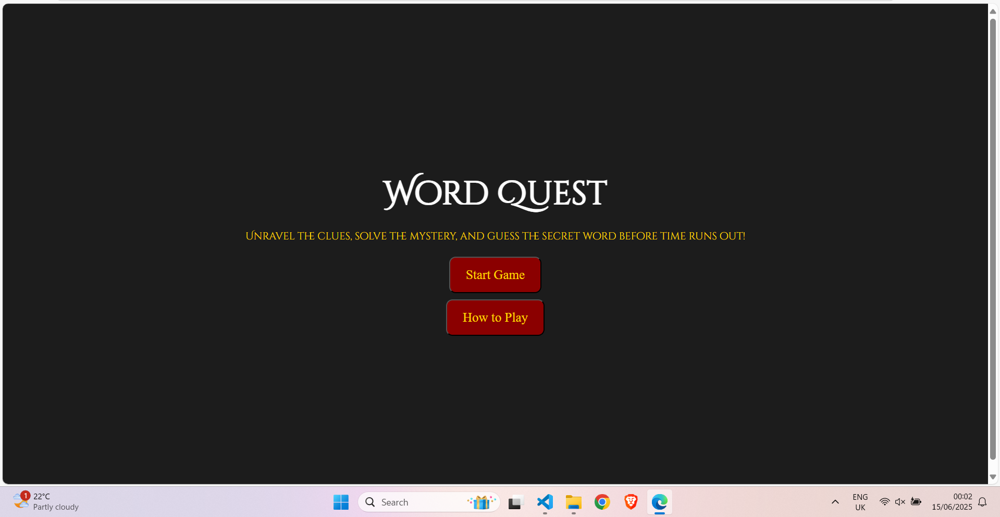
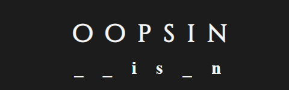
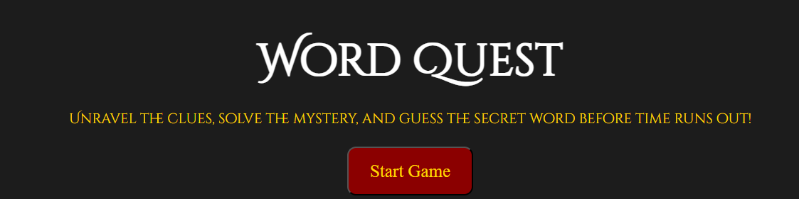
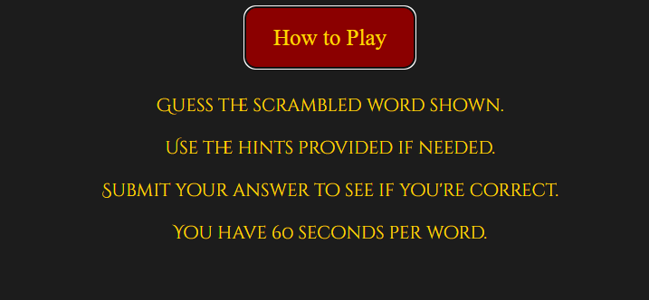
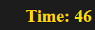
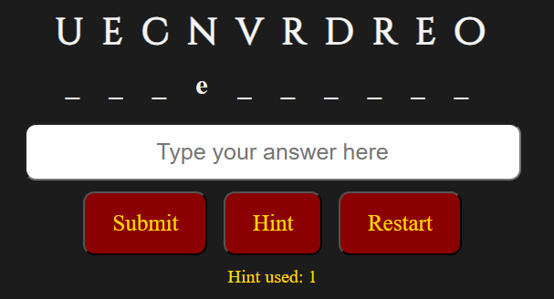
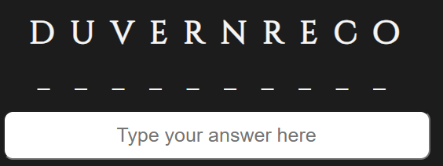

## Table of Contents

- [Table of Contents](#table-of-contents)
- [Code Validator](#code-validator)
  - [HTML Testing](#html-testing)
  - [CSS Testing](#css-testing)
- [Browser Performance](#browser-performance)
- [Responsiveness](#responsiveness)
- [Lighthouse Audit](#lighthouse-audit)
- [User Story Testing](#user-story-testing)
- [Testing Existing Features](#testing-existing-features)

## Code Validator

### HTML Testing

Click here to view HTML Testing

| Page | Errors                                           | Changes Made                                   |
| ---- | ------------------------------------------------ | ---------------------------------------------- |
| HTML |  |  |

### CSS Testing

Click here to view CSS Testing

| Page | Errors                                          | Changes Made                                  |
| ---- | ----------------------------------------------- | --------------------------------------------- |
| CSS  |  |  |

## Browser Performance

Click here to view the Browser Performance

| Browser         | Screenshots                                           |
| --------------- | ----------------------------------------------------- |
| Google Chrome   |     |
| Mozilla Firefox |  |
| Brave           |              |
| Microsoft Edge  |        |

## Responsiveness

Click here to see the responsiveness of the game

| Device | Screenshot                                             |
| ------ | ------------------------------------------------------ |
| Mobile |  |
| Tablet |  |
| Laptop |  |

## Lighthouse Audit

Click here to see Lighthouse Audit results

| Device  | Screenshot                                                     | Changes Made    |
| ------- | -------------------------------------------------------------- | --------------- |
| Desktop |  | No changes made |
| Mobile  |    | No changes made |

## User Story Testing

Click here to see the User Story Testing

| **User Story**                                                                           | **Testing**                                                                                   | **Screenshot**                                                         |
| ---------------------------------------------------------------------------------------- | --------------------------------------------------------------------------------------------- | ---------------------------------------------------------------------- |
| As a new user, I would like to see a clear word so I know what the game is.              | Click "Start Game" and check if a scrambled word appears on screen.                           |                          |
| As a new user, I would like to see a Start Game button so I can begin playing easily.    | Confirm the Start Game button is visible and clickable when the game loads.                   |                |
| As a new user, I would like to see an Instructions button to understand how to play.     | Click the Instructions button and confirm that clear guidance appears.                        |         |
| As a new user, I would like to see a timer.                                              | Start a game and confirm the timer appears and begins counting down.                       |                       |
| As a new user, I would like to see a hint button to help me if I get stuck.              | Press the Hint button and check that it reveals one random unrevealed letter.                 |         |
| As a new user, I would like to see a restart button in case I want to play again.        | Complete the game and press Restart to ensure it resets everything.                  |     |
| As an existing user, I would like hints that help without giving too much away.          | Use the Hint button multiple times to check that only three letters are revealed per use.     |                   |
| As an existing user, I would like to enjoy the challenge and improve my guessing skills. | Check that the game provides different scrambled words each round to encourage replayability. |  |

## Testing Existing Features

Click here to see Testing of Existing Features

