## Table of Contents

- [Table of Contents](#table-of-contents)
- [Code Validator](#code-validator)
  - [HTML Testing](#html-testing)
  - [CSS Testing](#css-testing)
- [Browser Performance](#browser-performance)
- [Responsiveness](#responsiveness)
- [Lighthouse Audit](#lighthouse-audit)
- [User Story Testing](#user-story-testing)
- [Testing Existing Features](#testing-existing-features)
- [Bugs](#bugs)
- [Unfixed Bugs](#unfixed-bugs)
- [Javascript Testing](#javascript-testing)

## Code Validator

### HTML Testing

Click here to view HTML Testing

| Page | Errors                                                     | Changes Made                                             |
| ---- | ---------------------------------------------------------- | -------------------------------------------------------- |
| HTML | 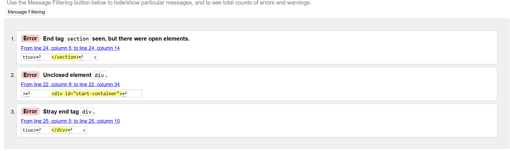 | 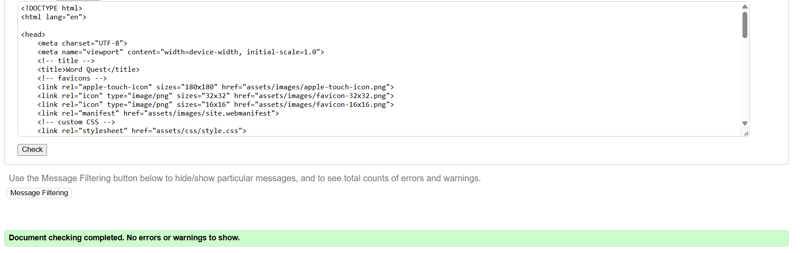 |

### CSS Testing

Click here to view CSS Testing

| Page | Errors                                                    | Changes Made                                            |
| ---- | --------------------------------------------------------- | ------------------------------------------------------- |
| CSS  | 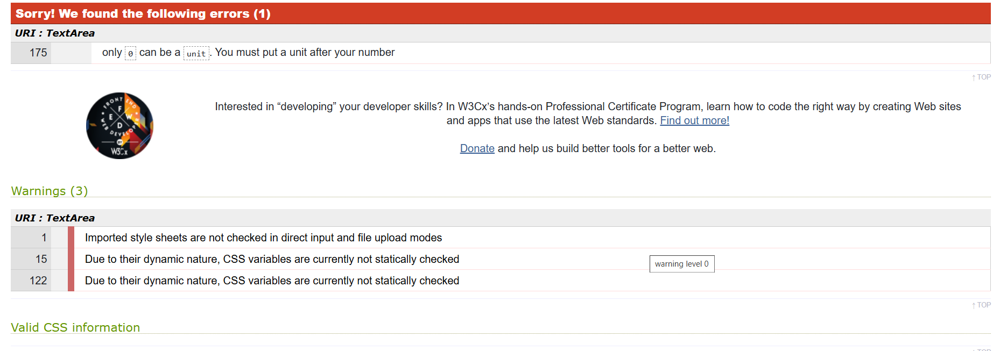 | 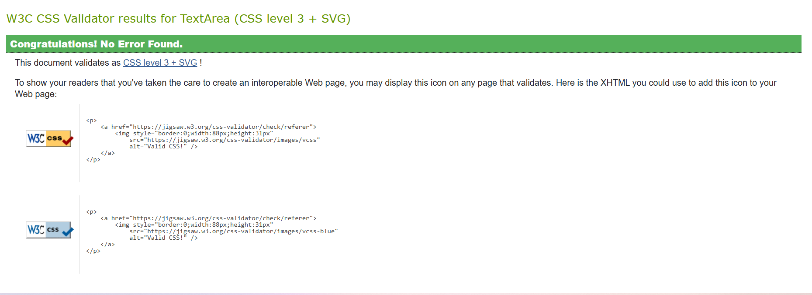 |

## Browser Performance

Click here to view the Browser Performance

| Browser         | Screenshots                                                   |
| --------------- | ------------------------------------------------------------- |
| Google Chrome   | 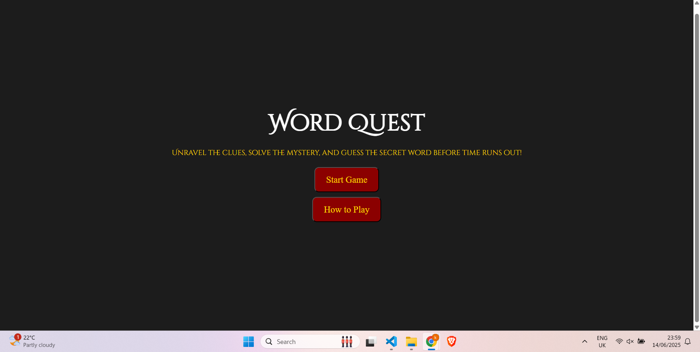    |
| Mozilla Firefox | 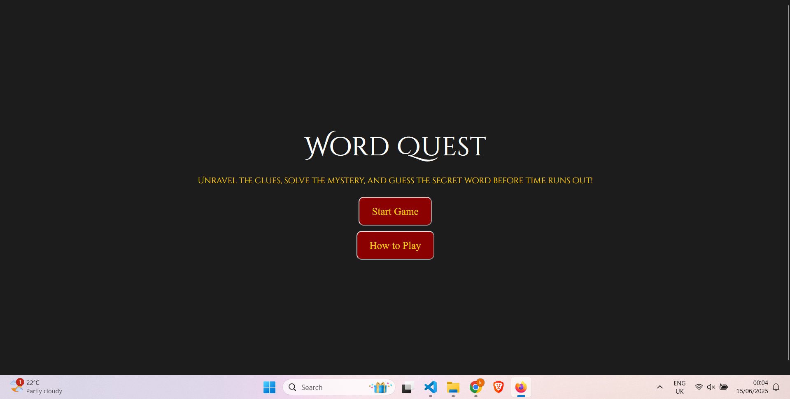 |
| Brave           | 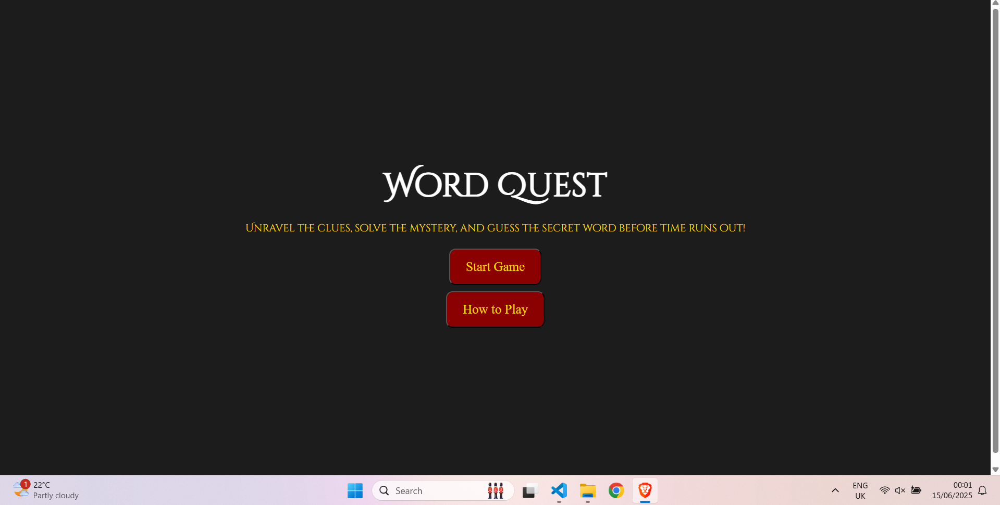             |
| Microsoft Edge  | 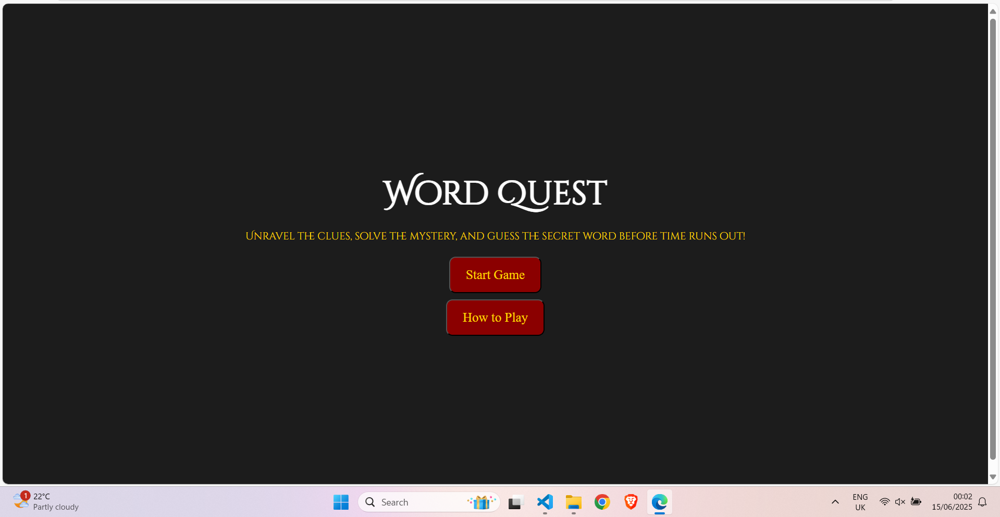       |

## Responsiveness

Click here to see the responsiveness of the game

| Device | Screenshot                                                            |
| ------ | --------------------------------------------------------------------- |
| Mobile | 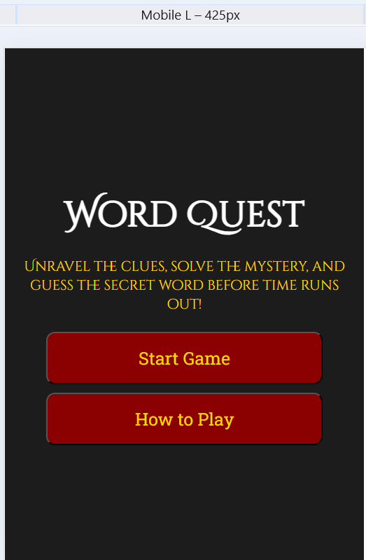 |
| Tablet | 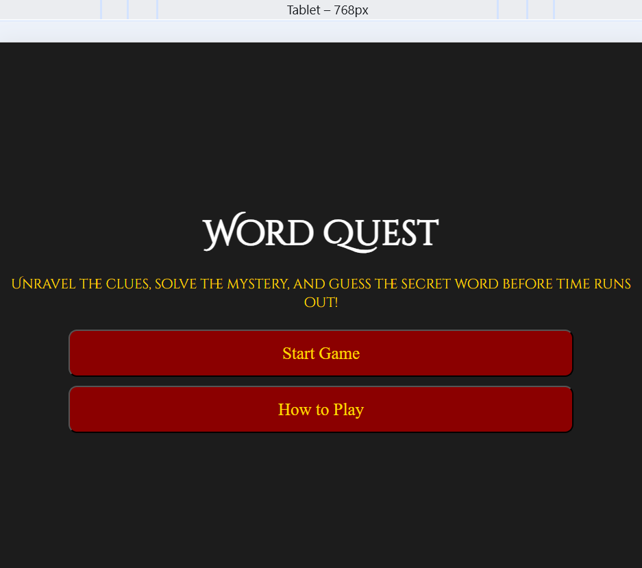 |
| Laptop | 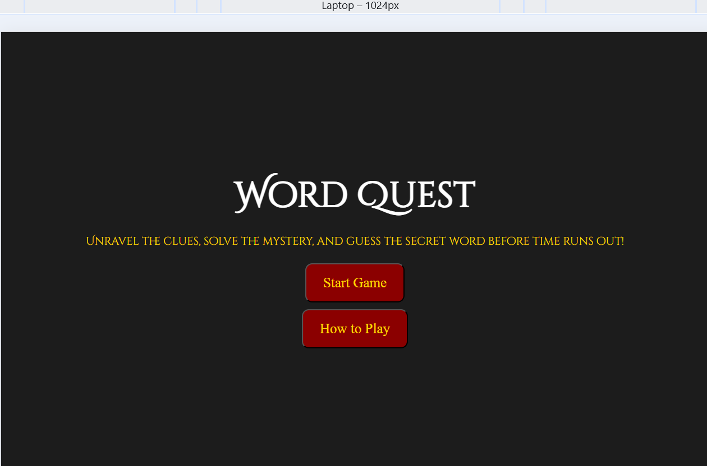 |

## Lighthouse Audit

Click here to see Lighthouse Audit results

| Device  | Screenshot                                                                | Changes Made    |
| ------- | ------------------------------------------------------------------------- | --------------- |
| Desktop | 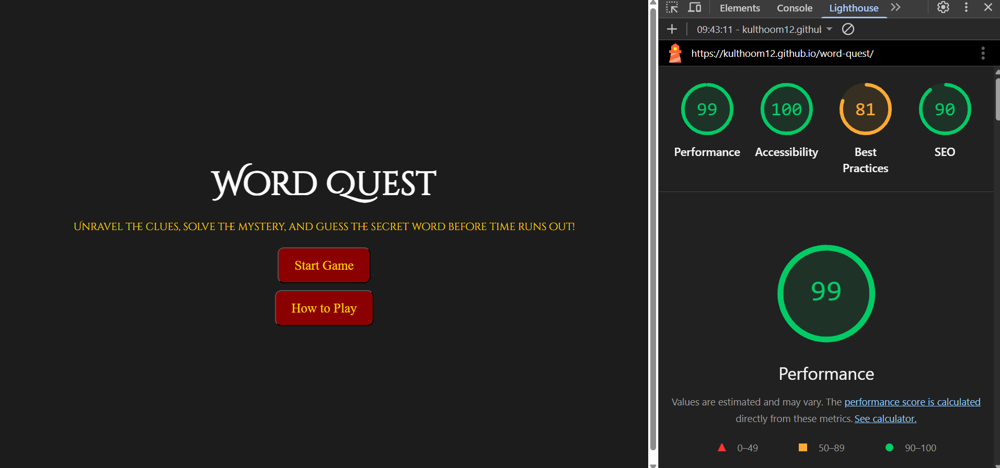 | No changes made |
| Mobile  | 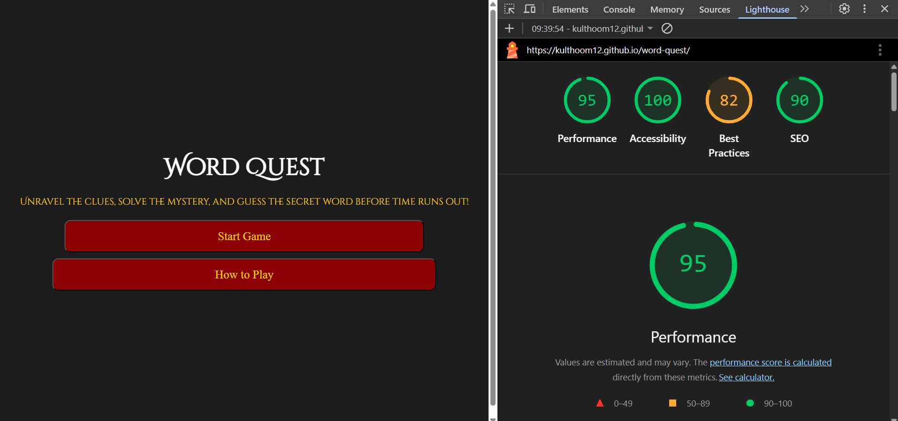   | No changes made |

## User Story Testing

Click here to see the User Story Testing

| **User Story**                                                                           | **Testing**                                                                                   | **Screenshot**                                                                             |
| ---------------------------------------------------------------------------------------- | --------------------------------------------------------------------------------------------- | ------------------------------------------------------------------------------------------ |
| As a new user, I would like to see a clear word so I know what the game is.              | Click "Start Game" and check if a scrambled word appears on screen.                           | 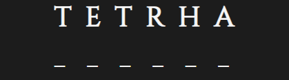             |
| As a new user, I would like to see a Start Game button so I can begin playing easily.    | Confirm the Start Game button is visible and clickable when the game loads.                   | 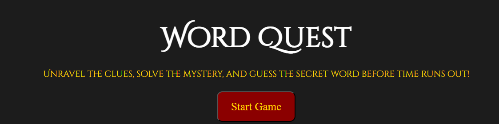                 |
| As a new user, I would like to see an Instructions button to understand how to play.     | Click the Instructions button and confirm that clear guidance appears.                        | 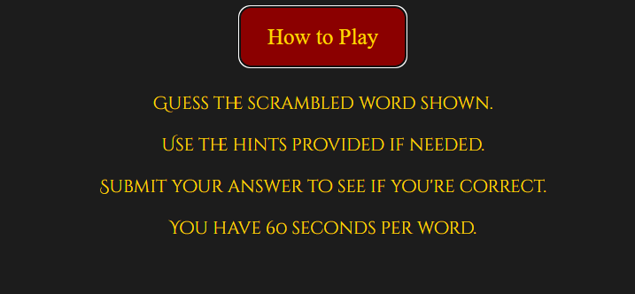         |
| As a new user, I would like to see a timer.                                              | Start a game and confirm the timer appears and begins counting down.                          | 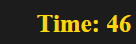                       |
| As a new user, I would like to see a hint button to help me if I get stuck.              | Press the Hint button and check that it reveals one random unrevealed letter.                 | 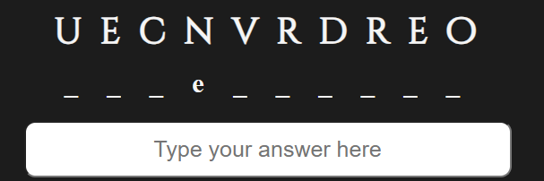              |
| As a new user, I would like to see a restart button in case I want to play again.        | Complete the game and press Restart to ensure it resets everything.                           |      |
| As an existing user, I would like hints that help without giving too much away.          | Use the Hint button multiple times to check that only three letters are revealed per use.     | 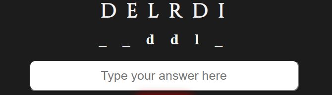           |
| As an existing user, I would like to enjoy the challenge and improve my guessing skills. | Check that the game provides different scrambled words each round to encourage replayability. | 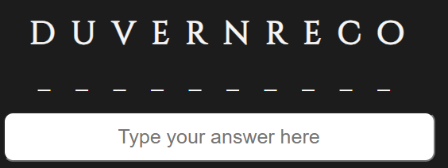 |

## Testing Existing Features

Click here to see Testing of Existing Features

| **Feature**                | **What Was Tested**                                                                                                          | **Screenshot**                                                           |
| -------------------------- | ---------------------------------------------------------------------------------------------------------------------------- | ------------------------------------------------------------------------ |
| **How to Play Button**     | I clicked the "How to Play" button to check that the instructions appeared clearly.                                          | 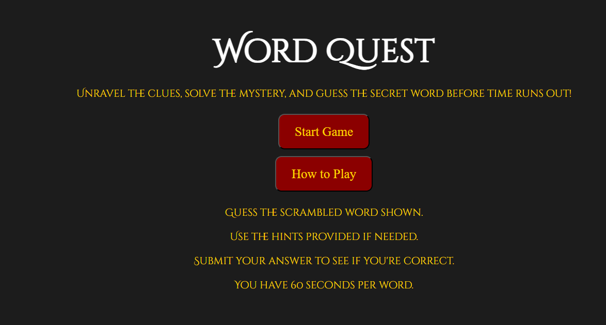 |
| **Start Game Button**      | I clicked the Start Game button and confirmed that a scrambled word appears when the game begins.                            | 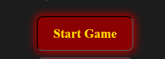 |
| **Restart Button**         | I clicked the Restart button to confirm it resets the game to the beginning.                                                 | 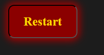           |
| **Submit Button**          | I typed in a word and clicked Submit to check that the game accepts and checks the answer correctly.                         | 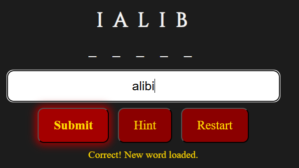             |
| **Three Letters Per Word** | I used the Hint button up to three times during one word to confirm it shows one unrevealed letter each time (max of three). | 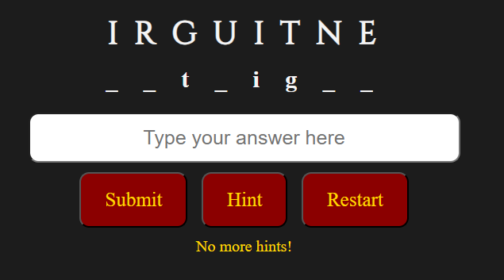   |

## Bugs 

## Unfixed Bugs 

No bugs found to my knowledge.

## Javascript Testing 

The Javascript was tested with [JS Lint](https://www.jslint.com/)

